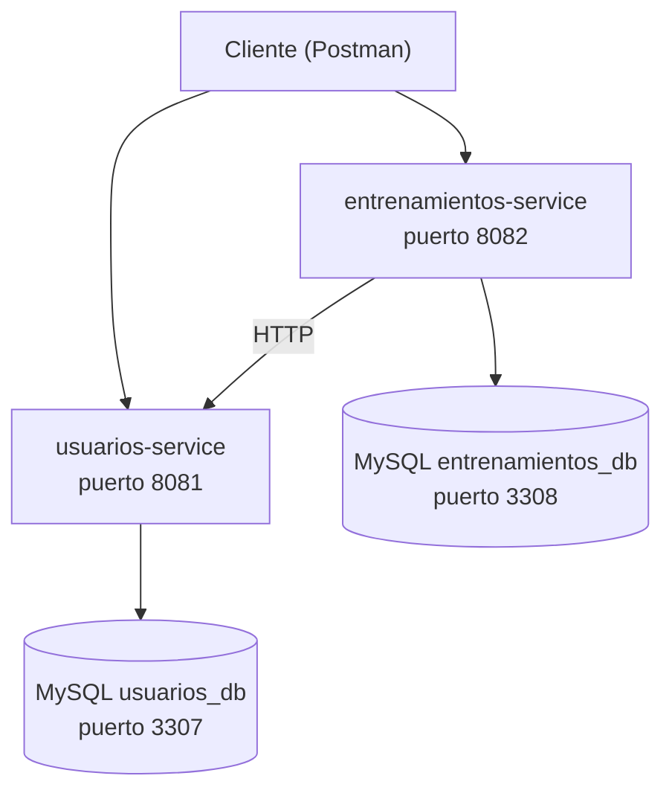

# Training Microservices

Sistema de seguimiento de entrenamientos construido con arquitectura de microservicios
(Spring Boot, MySQL, Docker Compose). Gestiona usuarios, entrenamientos y marcas personales de peso.

## Arquitectura

El sistema está compuesto por dos microservicios independientes,
cada uno con su propia base de datos MySQL, que se comunican entre sí mediante HTTP (RestClient):

## Arquitectura

El sistema está compuesto por dos microservicios independientes, cada uno con su propia base de datos MySQL,
que se comunican entre sí mediante HTTP (RestClient):



`entrenamientos-service` valida contra `usuarios-service` que un usuario existe antes de crear un registro de entrenamiento
o un récord personal (PR). Cada base de datos es completamente independiente: no hay claves foráneas entre servicios,
solo referencias por id validadas vía HTTP.


`entrenamientos-service` valida contra `usuarios-service` que un usuario existe antes de crear un registro de entrenamiento
o un récord personal (PR). 
Cada base de datos es completamente independiente: no hay claves foráneas entre servicios, solo referencias por id validadas vía HTTP.

## Stack tecnológico usado:

- Java 21
- Spring Boot 3.5.16
- Spring Data JPA / Hibernate
- Spring Validation
- RestClient (comunicación entre microservicios)
- MySQL 8
- Docker / Docker Compose
- Maven
- Lombok
- Eclipse IDE / VS Code

## Servicios

### usuarios-service (puerto 8081)

Gestiona los usuarios y su perfil físico (peso, altura, histórico).

| Método | Endpoint | Descripción |
|---|---|---|
| POST | `/usuarios` | Crea un usuario |
| GET | `/usuarios/{id}` | Consulta un usuario |
| GET | `/usuarios` | Lista todos los usuarios |
| PUT | `/usuarios/{id}` | Actualiza un usuario |
| DELETE | `/usuarios/{id}` | Elimina un usuario |
| GET | `/usuarios/{id}/existe` | Comprueba si un usuario existe (uso interno, consumido por entrenamientos-service) |
| POST | `/perfiles` | Crea un registro de perfil físico |
| GET | `/perfiles/usuario/{usuarioId}` | Historial de perfil físico de un usuario |

### entrenamientos-service (puerto 8082)

Gestiona ejercicios, entrenamientos, registros de entrenamiento y récords personales (PR).

| Método | Endpoint | Descripción |
|---|---|---|
| POST | `/ejercicios` | Crea un ejercicio |
| GET | `/ejercicios/{id}` | Consulta un ejercicio |
| GET | `/ejercicios` | Lista todos los ejercicios |
| POST | `/entrenamientos` | Crea un entrenamiento |
| GET | `/entrenamientos/{id}` | Consulta un entrenamiento |
| GET | `/entrenamientos` | Lista todos los entrenamientos |
| GET | `/entrenamientos/hoy` | Entrenamientos programados para hoy |
| POST | `/entrenamiento-ejercicios` | Añade un ejercicio a un entrenamiento |
| GET | `/entrenamiento-ejercicios/entrenamiento/{id}` | Ejercicios de un entrenamiento |
| POST | `/registros` | Crea un registro de entrenamiento (valida el usuario vía HTTP) |
| GET | `/registros/usuario/{usuarioId}` | Historial de entrenamientos de un usuario |
| POST | `/prs` | Registra un nuevo récord personal (solo si supera el anterior) |
| GET | `/prs/usuario/{usuarioId}` | Evolución de récords personales de un usuario |

## Cómo levantarlo en local

**Requisitos:** Docker Desktop, Java 21, Maven (o el wrapper incluido `mvnw`)

1. Clona el repositorio:
```bash
git clone https://github.com/AirooSs/training-microservices.git
cd training-microservices
```

2. Levanta las bases de datos MySQL con Docker Compose:
```bash
docker compose up -d
```

3. Arranca `usuarios-service` (puerto 8081):
```bash
cd usuarios-service
./mvnw spring-boot:run
```

4. En otra terminal, arranca `entrenamientos-service` (puerto 8082):
```bash
cd entrenamientos-service
./mvnw spring-boot:run
```

5. Ambos servicios generan sus tablas automáticamente al arrancar (Hibernate `ddl-auto=update`),
   no hace falta ejecutar ningún script SQL manual.

## Modelo de datos

El modelo se divide en dos bases de datos independientes:

**usuarios_db**
- `Usuario`: datos básicos del usuario
- `PerfilFisico`: histórico de peso y altura (relación 1:N con Usuario)

**entrenamientos_db**
- `Ejercicio`: catálogo de ejercicios (clasificados por patrón de movimiento: empuje, tracción, pierna)
- `Entrenamiento`: sesiones de entrenamiento (fuerza, hipertrofia o cardio)
- `EntrenamientoEjercicio`: tabla intermedia que resuelve la relación N:M entre Entrenamiento y Ejercicio
- `Registro`: resultado de un usuario en un entrenamiento concreto
- `PR`: récord personal de un usuario en un ejercicio (peso máximo levantado)

**Decisión de diseño clave:** los campos `usuarioId` en `Registro` y `PR` no son claves foráneas reales
(JPA no puede hacer JOIN entre dos bases de datos distintas).
Son referencias sueltas (`Long`) que se validan mediante una llamada HTTP a `usuarios-service` antes de guardar cualquier registro.

## Testing

Probado manualmente de extremo a extremo con Postman: creación de usuarios y perfiles, creación de ejercicios y entrenamientos,
comunicación HTTP real entre microservicios (validación de usuario existente),
y lógica de negocio de récords personales (rechazo de un peso que no supera el récord actual).

## Próximas mejoras posibles:

- Tests de integración automatizados con Testcontainers
- Spring Cloud Gateway como punto de entrada único
- Autenticación JWT
- Service discovery con Eureka
- Comunicación asíncrona con eventos (Kafka o RabbitMQ) para desacoplar aún más los servicios

## Autor

Francisco José Soria Navarrete
[LinkedIn](https://linkedin.com/in/fran-soria-nav) · [GitHub](https://github.com/AirooSs)
