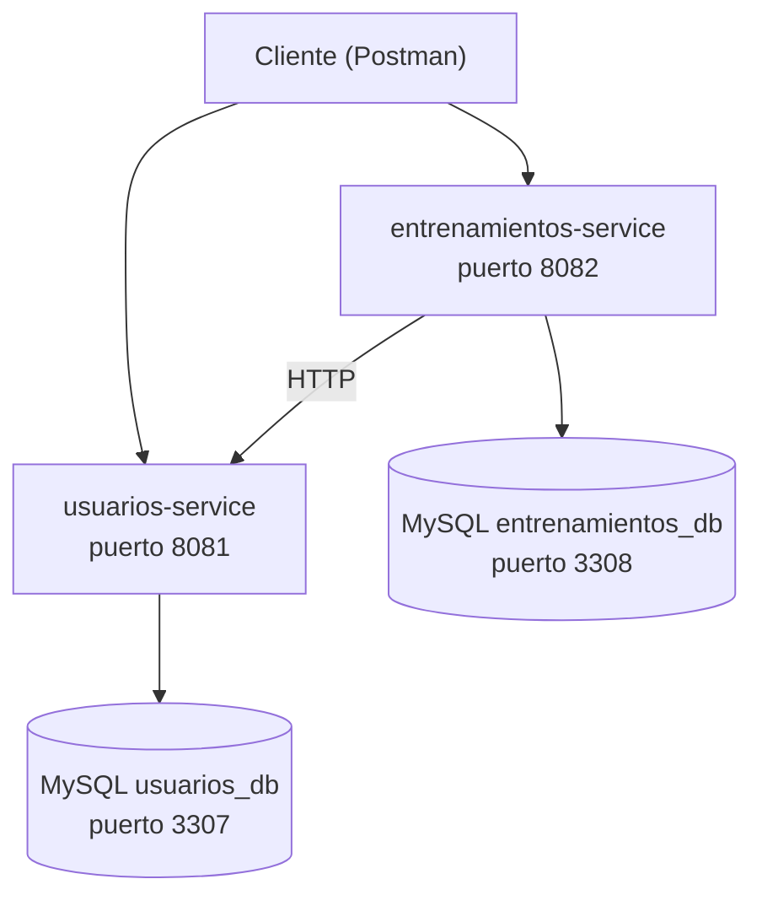

# Training Microservices

Sistema de seguimiento de entrenamientos construido con arquitectura de microservicios (Spring Boot, MySQL, Docker Compose). Gestiona usuarios, entrenamientos y récords personales.

## Objetivo del proyecto

Este proyecto ha sido desarrollado como proyecto personal para practicar una arquitectura basada en principios utilizados en entornos reales con Spring Boot. El objetivo no es construir una aplicación completa de cara a producción, sino aplicar conceptos que se usan en proyectos reales: separación de dominios, bases de datos independientes por servicio, y comunicación HTTP entre servicios.

## Estructura del proyecto:
'''
training-microservices/
├── usuarios-service/
├── entrenamientos-service/
├── docker-compose.yml
└── README.md
'''

## Arquitectura

El sistema está compuesto por dos microservicios independientes, cada uno con su propia base de datos MySQL, que se comunican entre sí mediante HTTP (RestClient):

`entrenamientos-service` valida contra `usuarios-service` que un usuario existe antes de crear un registro de entrenamiento o un récord personal (PR). Cada base de datos es completamente independiente: no hay claves foráneas entre servicios, solo referencias por id validadas vía HTTP.

## Decisiones de diseño

## Decisiones de diseño

- Una base de datos MySQL independiente por microservicio, sin acceso cruzado.
- Comunicación síncrona mediante HTTP en lugar de eventos.
- Validación del usuario contra usuarios-service antes de crear cualquier recurso que dependa de él.
- Los campos usuarioId en Registro y PR son referencias sueltas (Long), no claves foráneas.
- DTOs específicos por endpoint en lugar de exponer las entidades JPA directamente en la API.
- Manejo de errores centralizado, distinguiendo entre "recurso no encontrado" (404) y "servicio externo no disponible" (503).

El razonamiento completo detrás de cada decisión (contexto, alternativas consideradas y consecuencias) está documentado como Architecture Decision Records en [docs/](docs/):

- [0001. Comunicación HTTP síncrona en lugar de eventos](docs/0001-comunicacion-http-vs-eventos.md)
- [0002. Una base de datos independiente por microservicio](docs/0002-base-de-datos-por-servicio.md)
- [0003. Qué ocurre si usuarios-service deja de estar disponible](docs/0003-manejo-de-fallos-usuarios-service.md)
- [0004. Cómo evolucionaría la arquitectura si el sistema creciera](docs/0004-evolucion-futura-de-la-arquitectura.md)

## Stack tecnológico

- Java 21
- Spring Boot 3.5.16
- Spring Data JPA / Hibernate
- Spring Validation
- RestClient (comunicación entre microservicios)
- MySQL 8
- Docker / Docker Compose
- Maven
- Lombok

## Servicios

### usuarios-service (puerto 8081)

Gestiona los usuarios y su perfil físico (peso, altura, histórico).

| Método | Endpoint | Descripción |
|---|---|---|
| POST | /usuarios | Crea un usuario |
| GET | /usuarios/{id} | Consulta un usuario |
| GET | /usuarios | Lista todos los usuarios |
| PUT | /usuarios/{id} | Actualiza un usuario |
| DELETE | /usuarios/{id} | Elimina un usuario |
| GET | /usuarios/{id}/existe | Comprueba si un usuario existe (uso interno, consumido por entrenamientos-service) |
| POST | /perfiles | Crea un registro de perfil físico |
| GET | /perfiles/usuario/{usuarioId} | Historial de perfil físico de un usuario |

### entrenamientos-service (puerto 8082)

Gestiona ejercicios, entrenamientos, registros de entrenamiento y récords personales (PR).

| Método | Endpoint | Descripción |
|---|---|---|
| POST | /ejercicios | Crea un ejercicio |
| GET | /ejercicios/{id} | Consulta un ejercicio |
| GET | /ejercicios | Lista todos los ejercicios |
| POST | /entrenamientos | Crea un entrenamiento |
| GET | /entrenamientos/{id} | Consulta un entrenamiento |
| GET | /entrenamientos | Lista todos los entrenamientos |
| GET | /entrenamientos/hoy | Entrenamientos programados para hoy |
| POST | /entrenamiento-ejercicios | Añade un ejercicio a un entrenamiento |
| GET | /entrenamiento-ejercicios/entrenamiento/{id} | Ejercicios de un entrenamiento |
| POST | /registros | Crea un registro de entrenamiento (valida el usuario vía HTTP) |
| GET | /registros/usuario/{usuarioId} | Historial de entrenamientos de un usuario |
| POST | /prs | Registra un nuevo récord personal (solo si supera el anterior) |
| GET | /prs/usuario/{usuarioId} | Evolución de récords personales de un usuario |

Nota: Se expone un endpoint específico para comprobar la existencia de un usuario y evitar acoplar el servicio consumidor a la representación completa del recurso. De este modo, entrenamientos-service solo necesita conocer si el usuario existe, no sus datos.

## Cómo levantarlo en local

Requisitos: Docker Desktop, Java 21, Maven (o el wrapper incluido mvnw)

1. Clona el repositorio:

git clone https://github.com/AirooSs/training-microservices.git
cd training-microservices

2. Levanta las bases de datos MySQL con Docker Compose:

docker compose up -d

3. Arranca usuarios-service (puerto 8081):

cd usuarios-service
./mvnw spring-boot:run

4. En otra terminal, arranca entrenamientos-service (puerto 8082):

cd entrenamientos-service
./mvnw spring-boot:run

5. Ambos servicios generan sus tablas automáticamente mediante spring.jpa.hibernate.ddl-auto=update, una configuración adecuada para desarrollo. En entornos de producción sería recomendable utilizar herramientas de migración como Flyway o Liquibase.

## Modelo de datos

El modelo se divide en dos bases de datos independientes:

usuarios_db
- Usuario: datos básicos del usuario
- PerfilFisico: histórico de peso y altura (relación 1:N con Usuario)

entrenamientos_db
- Ejercicio: catálogo de ejercicios (clasificados por patrón de movimiento: empuje, tracción, pierna)
- Entrenamiento: sesiones de entrenamiento (fuerza, hipertrofia o cardio)
- EntrenamientoEjercicio: tabla intermedia que resuelve la relación N:M entre Entrenamiento y Ejercicio
- Registro: resultado de un usuario en un entrenamiento concreto
- PR: récord personal de un usuario en un ejercicio (peso máximo levantado)

## Testing

Actualmente dispone de pruebas funcionales manuales mediante Postman. Los tests automatizados forman parte del roadmap: creación de usuarios y perfiles, creación de ejercicios y entrenamientos, comunicación HTTP real entre microservicios (validación de usuario existente), y lógica de negocio de récords personales (rechazo de un peso que no supera el récord actual).

## Lo aprendido

Durante este proyecto he practicado:

- Diseño y desarrollo de microservicios con Spring Boot
- Comunicación HTTP síncrona entre servicios con RestClient
- Diseño de bases de datos independientes por dominio
- Validaciones cruzadas entre servicios
- JPA / Hibernate, incluyendo relaciones N:M con tabla intermedia
- Manejo de errores centralizado en una API REST
- Uso de DTOs para desacoplar la API del modelo de datos interno
- Orquestación de contenedores con Docker Compose

## Roadmap (lo no marcado son posibles implementaciones futuras)

- [x] Comunicación HTTP entre microservicios
- [x] Docker Compose con bases de datos independientes
- [x] Manejo de errores centralizado
- [ ] Documentación OpenAPI / Swagger
- [ ] Tests de integración con Testcontainers
- [ ] Spring Cloud Gateway
- [ ] Autenticación JWT
- [ ] Service discovery con Eureka
- [ ] Comunicación asíncrona con eventos (Kafka o RabbitMQ)

## Autor

Francisco José Soria Navarrete
[LinkedIn](https://linkedin.com/in/fran-soria-nav) · [GitHub](https://github.com/AirooSs)
