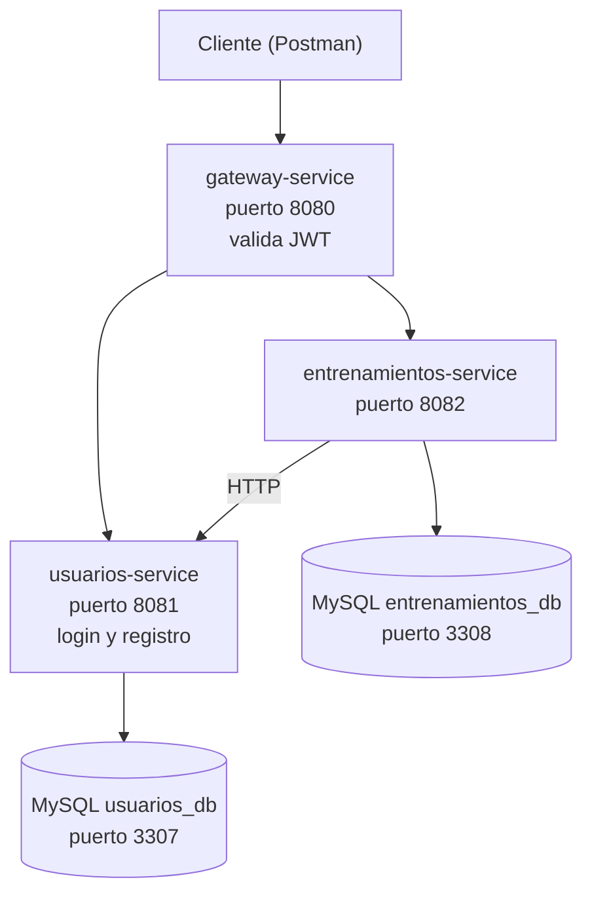

# Training Microservices


Sistema de seguimiento de entrenamientos construido con arquitectura de microservicios (Spring Boot, MySQL, Docker Compose, Kubernetes). Gestiona usuarios, entrenamientos y récords personales.

## Objetivo del proyecto

Este proyecto ha sido desarrollado como proyecto personal para practicar una arquitectura basada en principios utilizados en entornos reales con Spring Boot. El objetivo no es construir una aplicación completa de cara a producción, sino aplicar conceptos que se usan en proyectos reales: separación de dominios, bases de datos independientes por servicio, comunicación HTTP entre servicios, su orquestación y su seguridad.

## Estructura del proyecto:
```
training-microservices/
├── usuarios-service/
├── entrenamientos-service/
├── gateway-service/
├── k8s/
├── docs/
│   └── decisions/
├── docker-compose.yml
└── README.md
```

## Arquitectura

El sistema está compuesto por dos microservicios de negocio, cada uno con su propia base de datos MySQL, y un Gateway que actúa como único punto de entrada y valida la autenticación:


```mermaid
flowchart TB
    Cliente["Cliente (Postman)"]
    GW["gateway-service<br/>puerto 8080<br/>valida JWT"]
    US["usuarios-service<br/>puerto 8081<br/>login y registro"]
    ES["entrenamientos-service<br/>puerto 8082"]
    DBU[("MySQL usuarios_db<br/>puerto 3307")]
    DBE[("MySQL entrenamientos_db<br/>puerto 3308")]

    Cliente --> GW
    GW --> US
    GW --> ES
    ES -- HTTP --> US
    US --> DBU
    ES --> DBE
```

`entrenamientos-service` valida contra `usuarios-service` que un usuario existe antes de crear un registro de entrenamiento o un récord personal (PR). Cada base de datos es completamente independiente: no hay claves foráneas entre servicios, solo referencias por id validadas vía HTTP.

`gateway-service` no tiene lógica de negocio ni base de datos propia: enruta las peticiones externas hacia el microservicio correspondiente según la ruta solicitada, y valida el token JWT de cada petición antes de dejarla pasar, de forma que el cliente solo necesita conocer un único puerto (8080) y autenticarse una sola vez.

El sistema puede desplegarse de dos formas: con Docker Compose (más simple, pensado para desarrollo rápido) o con Kubernetes (más cercano a un entorno real, con recuperación automática de Pods y service discovery nativo).

## Decisiones de diseño

- Una base de datos MySQL independiente por microservicio, sin acceso cruzado.
- Comunicación síncrona mediante HTTP en lugar de eventos.
- Validación del usuario contra usuarios-service antes de crear cualquier recurso que dependa de él.
- Los campos usuarioId en Registro y PR son referencias sueltas (Long), no claves foráneas.
- DTOs específicos por endpoint en lugar de exponer las entidades JPA directamente en la API.
- Manejo de errores centralizado, distinguiendo entre "recurso no encontrado" (404) y "servicio externo no disponible" (503).
- Orquestación con Kubernetes como alternativa a Docker Compose, resolviendo de forma nativa el service discovery entre microservicios.
- Documentación de API generada automáticamente con OpenAPI/Swagger a partir del propio código.
- API Gateway como punto de entrada único, desacoplando al cliente de la topología interna de microservicios.
- Autenticación JWT validada de forma centralizada en el Gateway, en lugar de duplicar la lógica de seguridad en cada microservicio.

El razonamiento completo detrás de cada decisión (contexto, alternativas consideradas y consecuencias) está documentado como Architecture Decision Records en [docs/decisions/](docs/decisions/):

- [0001. Comunicación HTTP síncrona en lugar de eventos](docs/decisions/0001-comunicacion-http-vs-eventos.md)
- [0002. Una base de datos independiente por microservicio](docs/decisions/0002-base-de-datos-por-servicio.md)
- [0003. Qué ocurre si usuarios-service deja de estar disponible](docs/decisions/0003-manejo-de-fallos-usuarios-service.md)
- [0004. Cómo evolucionaría la arquitectura si el sistema creciera](docs/decisions/0004-evolucion-futura-de-la-arquitectura.md)
- [0005. Estrategia de testing: Testcontainers y aislamiento de contexto](docs/decisions/0005-estrategia-de-testing.md)
- [0006. Orquestación con Kubernetes](docs/decisions/0006-orquestacion-con-kubernetes.md)
- [0007. API Gateway como punto de entrada único](docs/decisions/0007-api-gateway.md)
- [0008. Autenticación JWT centralizada en el Gateway](docs/decisions/0008-autenticacion-jwt.md)

## Stack tecnológico

- Java 21
- Spring Boot 3.5.16 (usuarios-service, entrenamientos-service)
- Spring Boot 4.1.1 (gateway-service)
- Spring Cloud Gateway
- Spring Security (usuarios-service)
- JJWT (generación y validación de tokens JWT)
- Spring Data JPA / Hibernate
- Spring Validation
- RestClient (comunicación entre microservicios)
- MySQL 8
- Docker / Docker Compose
- Kubernetes (Minikube)
- Maven
- Lombok
- Testcontainers (tests de integración con base de datos real)
- OkHttp MockWebServer (simulación de usuarios-service en tests)
- springdoc-openapi (documentación interactiva con Swagger UI)

## Servicios

### gateway-service (puerto 8080)

Punto de entrada único del sistema. Sin lógica de negocio ni base de datos propia, enruta las peticiones al microservicio correspondiente y valida el token JWT de cada petición (salvo en las rutas públicas):

| Ruta | Redirige a | Requiere token |
|---|---|---|
| POST /auth/login | usuarios-service | No |
| POST /usuarios (registro) | usuarios-service | No |
| Resto de /usuarios/**, /perfiles/** | usuarios-service | Sí |
| /ejercicios/**, /entrenamientos/**, /entrenamiento-ejercicios/**, /registros/**, /prs/** | entrenamientos-service | Sí |

### usuarios-service (puerto 8081)

Gestiona los usuarios, su perfil físico (peso, altura, histórico), y la autenticación.

Documentación interactiva: `http://localhost:8081/swagger-ui.html`

| Método | Endpoint | Descripción |
|---|---|---|
| POST | /auth/login | Valida credenciales y devuelve un token JWT |
| POST | /usuarios | Crea un usuario (registro), con contraseña hasheada con BCrypt |
| GET | /usuarios/{id} | Consulta un usuario |
| GET | /usuarios | Lista todos los usuarios |
| PUT | /usuarios/{id} | Actualiza un usuario |
| DELETE | /usuarios/{id} | Elimina un usuario |
| GET | /usuarios/{id}/existe | Comprueba si un usuario existe (uso interno, consumido por entrenamientos-service) |
| POST | /perfiles | Crea un registro de perfil físico |
| GET | /perfiles/usuario/{usuarioId} | Historial de perfil físico de un usuario |

Nota: las respuestas de estos endpoints nunca incluyen el campo password, ni siquiera hasheado; se exponen a través de un DTO de respuesta que lo excluye explícitamente.

### entrenamientos-service (puerto 8082)

Gestiona ejercicios, entrenamientos, registros de entrenamiento y récords personales (PR).

Documentación interactiva: `http://localhost:8082/swagger-ui.html`

| Método | Endpoint | Descripción |
|---|---|---|
| POST | /ejercicios | Crea un ejercicio |
| GET | /ejercicios/{id} | Consulta un ejercicio |
| GET | /ejercicios | Lista todos los ejercicios |
| POST | /entrenamientos | Crea un entrenamiento |
| GET | /entrenamientos/{id} | Consulta un entrenamiento |
| GET | /entrenamientos | Lista todos los entrenamientos |
| GET | /entrenamientos/hoy | Entrenamientos programados para hoy |
| POST | /entrenamiento-ejercicios | Añade un ejercicio a un entrenamiento |
| GET | /entrenamiento-ejercicios/entrenamiento/{id} | Ejercicios de un entrenamiento |
| POST | /registros | Crea un registro de entrenamiento (valida el usuario vía HTTP) |
| GET | /registros/usuario/{usuarioId} | Historial de entrenamientos de un usuario |
| POST | /prs | Registra un nuevo récord personal (solo si supera el anterior) |
| GET | /prs/usuario/{usuarioId} | Evolución de récords personales de un usuario |

Nota: Se expone un endpoint específico para comprobar la existencia de un usuario y evitar acoplar el servicio consumidor a la representación completa del recurso. De este modo, entrenamientos-service solo necesita conocer si el usuario existe, no sus datos.

## Cómo levantarlo en local

### Opción A: Docker Compose (más simple, recomendado para desarrollo)

Requisitos: Docker Desktop, Java 21, Maven (o el wrapper incluido mvnw)

1. Clona el repositorio:

git clone https://github.com/AirooSs/training-microservices.git
cd training-microservices

2. Levanta las bases de datos MySQL con Docker Compose:

docker compose up -d

3. Arranca usuarios-service (puerto 8081):

cd usuarios-service
./mvnw spring-boot:run

4. En otra terminal, arranca entrenamientos-service (puerto 8082):

cd entrenamientos-service
./mvnw spring-boot:run

5. En una tercera terminal, arranca gateway-service (puerto 8080):

cd gateway-service
./mvnw spring-boot:run

6. Ambos servicios de negocio generan sus tablas automáticamente mediante spring.jpa.hibernate.ddl-auto=update, una configuración adecuada para desarrollo. En entornos de producción sería recomendable utilizar herramientas de migración como Flyway o Liquibase.

7. Todas las peticiones deben hacerse a través del Gateway en el puerto 8080. Primero regístrate y haz login para obtener un token:

POST http://localhost:8080/usuarios (registro, público)
POST http://localhost:8080/auth/login (login, público)

Con el token obtenido, añádelo como cabecera Authorization: Bearer <token> en el resto de peticiones.

8. La documentación interactiva de cada API sigue disponible en /swagger-ui.html de usuarios-service y entrenamientos-service (ver enlaces en la sección Servicios).

### Opción B: Kubernetes (con Minikube)

Requisitos adicionales: kubectl, Minikube

1. Arranca el clúster local:

minikube start --driver=docker

2. Apunta tu terminal al Docker interno de Minikube (necesario para que el clúster vea las imágenes que construyas):

minikube docker-env | Invoke-Expression

3. Construye las imágenes de los tres servicios:

cd usuarios-service
docker build -t usuarios-service:1.0 .
cd ../entrenamientos-service
docker build -t entrenamientos-service:1.0 .
cd ../gateway-service
docker build -t gateway-service:1.0 .
cd ..

4. Aplica todos los manifiestos:

kubectl apply -f k8s/

5. Comprueba que los 5 Pods están en estado Running:

kubectl get pods

6. Expón el Gateway para probarlo desde fuera del clúster; todas las peticiones pasan por este único punto de entrada:

kubectl port-forward service/gateway-service 8080:8080

El razonamiento completo de esta implementación (equivalencias con Docker Compose, cómo se resuelve el service discovery, y las limitaciones conocidas de este despliegue) está documentado en el [ADR 0006](docs/decisions/0006-orquestacion-con-kubernetes.md). El despliegue del Gateway se documenta en el [ADR 0007](docs/decisions/0007-api-gateway.md).

## Modelo de datos

El modelo se divide en dos bases de datos independientes:

usuarios_db
- Usuario: datos básicos del usuario, incluida la contraseña hasheada con BCrypt
- PerfilFisico: histórico de peso y altura (relación 1:N con Usuario)

entrenamientos_db
- Ejercicio: catálogo de ejercicios (clasificados por patrón de movimiento: empuje, tracción, pierna)
- Entrenamiento: sesiones de entrenamiento (fuerza, hipertrofia o cardio)
- EntrenamientoEjercicio: tabla intermedia que resuelve la relación N:M entre Entrenamiento y Ejercicio
- Registro: resultado de un usuario en un entrenamiento concreto
- PR: récord personal de un usuario en un ejercicio (peso máximo levantado)

## Testing

Ambos servicios de negocio cuentan con tests de integración automatizados usando Testcontainers, que levantan un contenedor MySQL real (no una base de datos en memoria) para cada ejecución:

- usuarios-service: creación de usuario, validación de email duplicado, consulta de usuario inexistente (404).
- entrenamientos-service: creación de un registro de entrenamiento con validación cruzada real contra un usuarios-service simulado (MockWebServer), cubriendo los tres escenarios: usuario existente (201), usuario inexistente (404), y usuarios-service no disponible (503).

El último escenario prueba de forma automatizada el comportamiento de resiliencia descrito en el [ADR 0003](docs/decisions/0003-manejo-de-fallos-usuarios-service.md).

Además, se ha probado manualmente de extremo a extremo con Postman en ambos entornos de despliegue (Docker Compose y Kubernetes): creación de ejercicios y entrenamientos, comunicación real entre Pods a través del Service de Kubernetes, enrutado correcto a través del Gateway hacia ambos microservicios, lógica de negocio de récords personales (rechazo de un peso que no supera el récord actual), y el flujo completo de autenticación (registro, login, acceso denegado sin token, acceso permitido con token válido).

## Lo aprendido

Durante este proyecto he practicado:

- Diseño y desarrollo de microservicios con Spring Boot
- Comunicación HTTP síncrona entre servicios con RestClient
- Diseño de bases de datos independientes por dominio
- Validaciones cruzadas entre servicios
- JPA / Hibernate, incluyendo relaciones N:M con tabla intermedia
- Manejo de errores centralizado en una API REST
- Uso de DTOs para desacoplar la API del modelo de datos interno
- Orquestación de contenedores con Docker Compose
- Tests de integración con Testcontainers y simulación de servicios externos con MockWebServer
- Orquestación con Kubernetes: Deployments, Services, PersistentVolumeClaims, Secrets y ConfigMaps
- Construcción de imágenes Docker multi-stage para aplicaciones Spring Boot
- Configuración externalizada de Spring Boot mediante variables de entorno según el entorno de despliegue
- Documentación de API con OpenAPI/Swagger, incluyendo códigos de respuesta y casos de error
- Configuración de un API Gateway con Spring Cloud Gateway, incluyendo depuración de cambios de configuración entre versiones recientes de la librería
- Autenticación con JWT: hasheo de contraseñas con BCrypt, generación y validación de tokens, y filtros globales reactivos (GlobalFilter) en Spring Cloud Gateway
- Uso de DTOs de respuesta para evitar exponer datos sensibles (como el hash de una contraseña) en una API REST

## Roadmap (lo no marcado son posibles implementaciones futuras)

- [x] Comunicación HTTP entre microservicios
- [x] Docker Compose con bases de datos independientes
- [x] Manejo de errores centralizado
- [x] Tests de integración con Testcontainers
- [x] Orquestación con Kubernetes
- [x] Documentación OpenAPI / Swagger
- [x] Spring Cloud Gateway
- [x] Despliegue de gateway-service en Kubernetes
- [x] Autenticación JWT
- [ ] Proteger entrenamientos-service directamente (no solo a través del Gateway), o restringir su acceso directo mediante reglas de red / NetworkPolicy en Kubernetes
- [ ] Comunicación asíncrona con eventos (Kafka o RabbitMQ)
- [ ] Gestión de secretos con una herramienta dedicada (Sealed Secrets o similar)

## Autor

Francisco José Soria Navarrete
[LinkedIn](https://linkedin.com/in/fran-soria-nav) · [GitHub](https://github.com/AirooSs)
